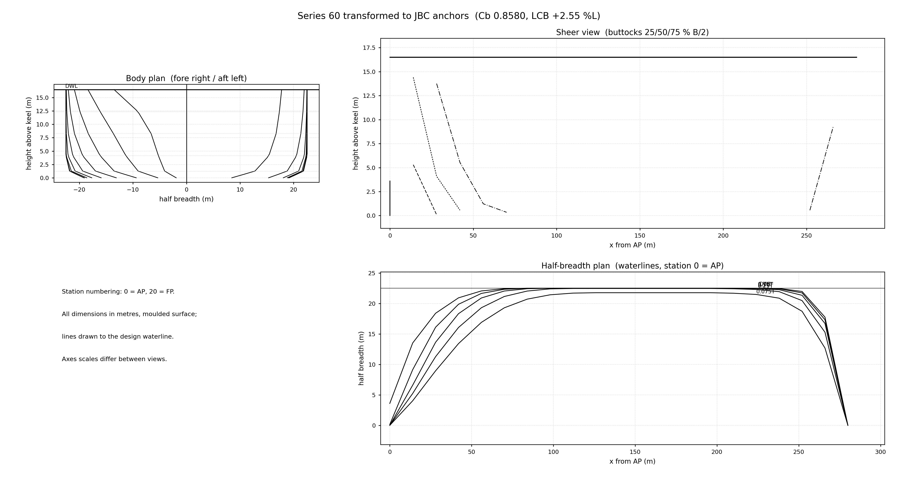
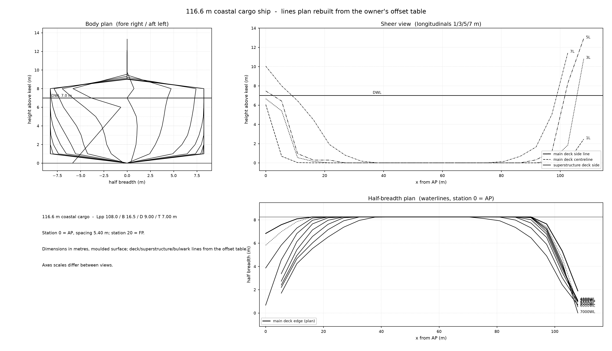

# OpenHull

**English** | [简体中文](README_zh.md) | [日本語](README_ja.md) | [한국어](README_ko.md) | [Deutsch](README_de.md) | [Français](README_fr.md) | [Español](README_es.md) | [Italiano](README_it.md) | [Português](README_pt.md) | [Русский](README_ru.md)

> Design the shell that carries it all.

Open-source parametric ship hull design toolchain, orchestrated by AI agents.

Provide a task book (ship type, deadweight, service speed, trading range) —
the agent pipeline returns principal dimensions, hydrostatics, a lines plan,
resistance / propulsion / stability estimates, and drawing outputs (DXF).

## Status

**v0.2 released** — stages 1–2 complete: task-book weight-buoyancy balance, principal dimensions, hydrostatics, initial stability & trim, freeboard checks, and the parametric hull-form chain — real digitised parent offsets, affine scaling, Lackenby transform, lines-plan output and numerical fairness checks — all validated against the JBC benchmark ship (see [VALIDATION.md](VALIDATION.md)). One command: `openhull run examples/taskbook_bulk_carrier.yaml`. — stage 1 complete: task-book weight-buoyancy balance, principal dimensions, hydrostatics, initial stability & trim, and freeboard checks — all validated against the JBC benchmark ship (see [VALIDATION.md](VALIDATION.md)). One command: `openhull run examples/taskbook_bulk_carrier.yaml`.

## Lines plan (stage-2 output)

## Roadmap

- [x] Stage 1 — Principal dimension iteration & hydrostatics core (**v0.1**)
- [x] Stage 2 — Parametric hull form generation (mother-ship transformation) (**v0.2**)
- [ ] Stage 3 — Performance loop: resistance / propulsion / stability
- [ ] Stage 4 — Drawing output (DXF) & design reports
- [ ] Stage 5 — Documentation & community release (v1.0)

## Design principles

1. Every output must be traceable to an equation or a published reference
2. Validation against published benchmark ships comes before new features
3. Empirical formulas declare their applicability range and refuse out-of-range input
4. What can be written as an equation is automated; what cannot is left to the engineer

## License

[MIT](LICENSE)
