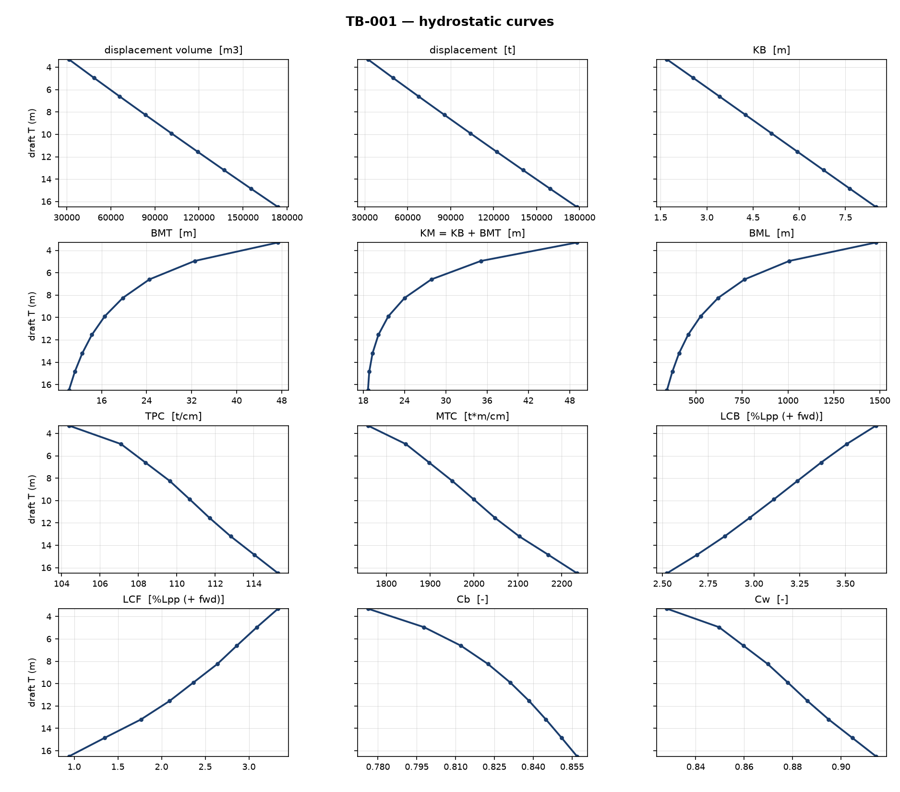

# OpenHull 初步设计报告 — TB-001

生成时间：2026-09-23 17:21 ｜ 工具链版本见 pyproject.toml

## 1. 主尺度与重量

- 垂线间长 Lpp = 271.63 m，型宽 B = 45.27 m，型深 D = 24.25 m，设计吃水 T = 16.77 m
- 方形系数 Cb：目标 0.8580，实际 0.8578（Lackenby 变换 13 次收敛）
- 载重量 DW = 149,920.0 t，排水量 Δ = 181,306.2 t，空船重量 LW = 31,386.2 t
- 载重量比 = 0.8269
- 诺曼系数 N = 1.160（重量浮力平衡 3 次收敛）

## 2. 静水力表（设计吃水行）

| 要素 | 数值 | 单位 |
|---|---|---|
| 排水体积 ∇ | 173,874.7 | m3 |
| 排水量 Δ | 178,221.6 | t |
| 水线面积 Aw | 11,245.8 | m2 |
| KB | 8.492 | m |
| BMT | 10.205 | m |
| KM = KB+BMT | 18.698 | m |
| TPC | 115.27 | t/cm |
| LCB | +2.5250 | %Lpp（+中前） |
| LCF | +0.9404 | %Lpp（+中前） |
| Cb / Cw | 0.8569 / 0.9145 | — |

> 完整静水力表由 `--csv` 输出；本表仅列设计吃水行。

## 3. 完整稳性（IMO 2008 IS Code 2.2）

| 衡准 | 要求 | 实际 | 判定 |
|---|---|---|---|
| IS Code 2.2.1(a) | 0.055 m*rad | 0.7178 | 满足 |
| IS Code 2.2.1(b) | 0.090 m*rad | 1.0739 | 满足 |
| IS Code 2.2.1(c) | 0.030 m*rad | 0.3561 | 满足 |
| IS Code 2.2.2 | 0.200 m | 2.1970 | 满足 |
| IS Code 2.2.3 | 25.000 deg | 27.5000 | 满足 |
| IS Code 2.2.4 | 0.150 m | 5.3996 | 满足 |

GM0 = 5.400 m（KG 13.29 m，自由液面修正 0.000 m）；总体：**全部满足**

## 4. 恶劣海况稳性（IS Code 2.3）

- 波浪衡准：面积 a = 0.3518 vs b = 1.3299 m·rad → 满足
- 横摇固有周期 12.18 s、横摇角 φ1 = 20.37°

## 5. 快速性与螺旋桨初步设计

- 螺旋桨设计**声明式跳过**：Invalid value for 'speed': 14.5
  allowed: V/sqrt(L) within 0.5-1.2 (knots/sqrt-ft); this speed gives 0.486
  why: the Ayre tables and corrections are tabulated for this speed-length band only (tables 7-5 and 7-7a/b); outside it the method refuses rather than extrapolate.

## 6. 耐波性初估（第一级，书内公式）

- 横摇固有周期 13.10 s（简式 15.59 s）、纵摇 11.11 s、垂荡 11.03 s
- 有效波倾系数 K = 0.680；谐摇放大因数 1/(2μ) = 8.3（μ = 0.06，书内区间中值假定）

| 运动 | 海区 | 波浪周期 | 调谐因数 Λ | 判定 |
|---|---|---|---|---|
| roll | East China Sea short wave (lambda 50-60 m) | 6 s | 2.18 | 区外 |
| pitch/heave | East China Sea short wave (lambda 50-60 m), head-sea encounter at 7.5 m/s | 6 s | 3.33 | 区外 |
| roll | ocean swell (lambda ~ 100 m) | 8 s | 1.64 | 区外 |
| pitch/heave | ocean swell (lambda ~ 100 m), head-sea encounter at 7.5 m/s | 8 s | 2.22 | 区外 |

> 波浪失速不在本层范围：白名单书内无失速估算公式。

## 7. 总布置简图（声明式分舱）

- 分舱来源：default bulk-carrier scheme；双层底高 2.26 m
- 舱室一览：

| 舱室 | 类型 | 纵向范围 (m) | 垂向范围 (m) |
|---|---|---|---|
| Aft Peak Tank | peak | 0.0 – 8.1 | 0.00 – 24.25 |
| Engine Room | machinery | 8.1 – 25.8 | 2.26 – 24.25 |
| Cargo Hold 1 | hold | 25.8 – 71.7 | 2.26 – 24.25 |
| Cargo Hold 2 | hold | 71.7 – 117.6 | 2.26 – 24.25 |
| Cargo Hold 3 | hold | 117.6 – 163.5 | 2.26 – 24.25 |
| Cargo Hold 4 | hold | 163.5 – 209.4 | 2.26 – 24.25 |
| Cargo Hold 5 | hold | 209.4 – 255.3 | 2.26 – 24.25 |
| Fore Peak Tank | peak | 255.3 – 271.6 | 0.00 – 24.25 |

## 附：声明

- 本报告由 OpenHull 自动生成，全部数字可溯源至 AGENTS.md 第 5 节公式来源白名单或任务书声明值；所附简图为声明式布局示意，非真实型线。
- 生成参数与中间量见同目录 JSON/CSV 输出。

## 附图：静水力曲线图

