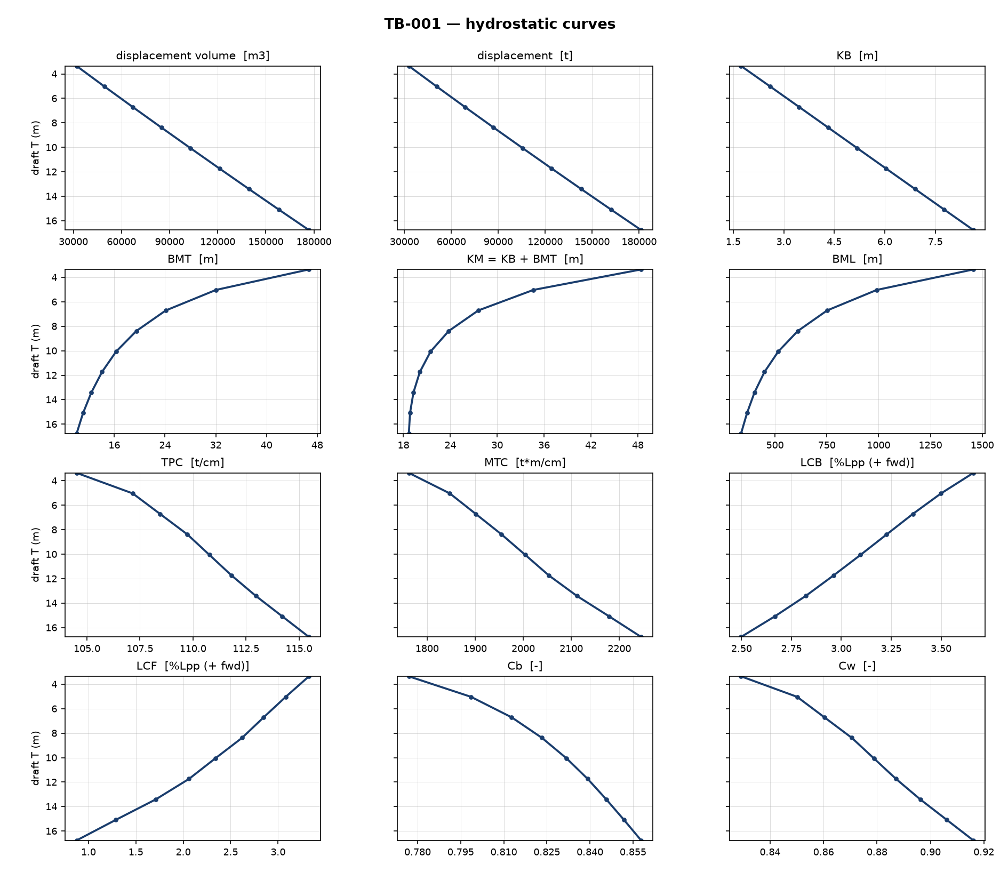

# OpenHull 初步设计报告 — TB-001

生成时间：2026-09-28 12:29 ｜ 工具链：openhull 1.0.3

## 1. 主尺度与重量

- 垂线间长 Lpp = 271.63 m，型宽 B = 45.27 m，型深 D = 24.25 m，设计吃水 T = 16.77 m
- 方形系数 Cb：目标 0.8580，实际 0.8578（Lackenby 变换 13 次收敛）
- 载重量 DW = 149,920.0 t，排水量 Δ = 181,306.2 t，空船重量 LW = 31,386.2 t
- 载重量比 = 0.8269
- ⚠ 任务书声明吃水 16.50 m 与重量平衡吃水 16.767 m 不一致：声明值低于平衡值 0.267 m——本报告全部结果按**平衡吃水**完成。
- 反算提示：按声明吃水 16.50 m 设计，所需 B/T ≈ 2.766（当前 2.700），在本工具的量纲比守卫带 [2.00, 3.50] 之内。
  - 口径与限制：保持排水量、Cb 与 L/B 不变（L、B 同步缩放）；一次性估算、未计入重量再平衡（按该值实算的吃水与声明值仍有同量级残差，实测 0.3–1.3%）；B/T 属算法统计参数、任务书无此字段，本工具不自动改动。
- 诺曼系数 N = 1.160（重量浮力平衡 3 次收敛）

## 2. 静水力表（设计吃水行）

| 要素 | 数值 | 单位 |
|---|---|---|
| 排水体积 ∇ | 176,881.9 | m3 |
| 排水量 Δ | 181,304.0 | t |
| 水线面积 Aw | 11,265.3 | m2 |
| KB | 8.631 | m |
| BMT | 10.058 | m |
| KM = KB+BMT | 18.690 | m |
| TPC | 115.47 | t/cm |
| LCB | +2.4975 | %Lpp（+中前） |
| LCF | +0.8751 | %Lpp（+中前） |
| Cb / Cw | 0.8578 / 0.9161 | — |
> 口径注：本表 Δ = 181,304.0 t 是船体在自身最深水线（16.767 m）积分所得；§1 的 Δ = 181,306.2 t 是重量平衡的闭合目标，两者相差 2.3 t（0.0013%），源于浮力积分路径与 Lackenby 变换收敛残差，不是两个互相矛盾的数。

> 完整静水力表由 `--csv` 输出；本表仅列设计吃水行。

## 3. 完整稳性（IMO 2008 IS Code 2.2）

| 衡准 | 要求 | 实际 | 判定 |
|---|---|---|---|
| IS Code 2.2.1(a) | 0.055 m*rad | 0.7178 | 满足 |
| IS Code 2.2.1(b) | 0.090 m*rad | 1.0739 | 满足 |
| IS Code 2.2.1(c) | 0.030 m*rad | 0.3561 | 满足 |
| IS Code 2.2.2 | 0.200 m | 2.1970 | 满足 |
| IS Code 2.2.3 | 25.000 deg | 27.5000 | 满足 |
| IS Code 2.2.4 | 0.150 m | 5.3996 | 满足 |

GM0 = 5.400 m（KG 13.29 m，自由液面修正 0.000 m）；总体：**全部满足**

## 4. 恶劣海况稳性（IS Code 2.3）

- 波浪衡准：面积 a = 0.3518 vs b = 1.3299 m·rad → 满足
- 横摇固有周期 12.18 s、横摇角 φ1 = 20.37°

## 5. 快速性与螺旋桨初步设计

- **本方案未能给出所需航速对应的功率。**

- 拒绝阶段：艾亚阻力估算（ayre）
- 生效主尺度：Lpp 271.6 m / Δ 181,306 t → L/Δ^(1/3) = 4.80（艾亚法惯例，Δ 以吨计）
- 可行方向（本船几何下艾亚速度带对应的航速窗口）：14.93–35.82 kn（任务书声明 14.50 kn）；也可用 `openhull optimize` 换主尺度比重扫。
- 工具原文（保留可溯源）：

  > Invalid value for 'speed': 14.5 allowed: V/sqrt(L) within 0.5-1.2 (knots/sqrt-ft); this speed gives 0.486 why: the Ayre tables and corrections are tabulated for this speed-length band only (tables 7-5 and 7-7a/b); outside it the method refuses rather than extrapolate.

- 可能原因：服务航速落在艾亚法速度-长度带 V/√L ∈ [0.50, 1.20] kn/√ft 之外，或 L/Δ^(1/3) 落在已数字化谱系带 [4.88, 6.41] 之外（图 7-3 目前只录入了中间谱系）。
- 可行方向：调整 Cb 或主尺度比（L/B、B/T）使本船进入上述带内；或等待 C₀ 图谱全谱系补录（数据 backlog）。
- 说明：白名单方法的适用域由项目章程锁定，工具拒绝在域外给出数字（拒绝优于外推）。是否调整设计需求属于专业判断，工具不替用户拍板。
- 可行域扫描：`openhull optimize <任务书> --grid-cb 下限:上限:档数` 可自动扫出哪些组合能进入各适用带（例如 `--grid-cb 0.70:0.84:8`），不必逐点手试（review 2026-09-25 P1-2）。

## 6. 耐波性初估（第一级，书内公式）

- 横摇固有周期 13.10 s（简式 15.59 s）、纵摇 11.10 s、垂荡 11.02 s
- 有效波倾系数 K = 0.680；谐摇放大因数 1/(2μ) = 8.3（μ = 0.06，书内区间中值假定）

| 运动 | 海区 | 波浪周期 | 调谐因数 Λ | 判定 |
|---|---|---|---|---|
| roll | East China Sea short wave (lambda 50-60 m) | 6 s | 2.18 | 区外 |
| pitch/heave | East China Sea short wave (lambda 50-60 m), head-sea encounter at 7.5 m/s | 6 s | 3.32 | 区外 |
| roll | ocean swell (lambda ~ 100 m) | 8 s | 1.64 | 区外 |
| pitch/heave | ocean swell (lambda ~ 100 m), head-sea encounter at 7.5 m/s | 8 s | 2.22 | 区外 |

> 口径注：§4 风浪衡准的横摇周期 12.18 s 用 IS Code 2.3 的规范简式（T = 2·C·B/√GM，不计附连水质量修正）；本节 13.10 s 用《船舶原理》下册的横摇固有周期式（式 3-27/3-49，含附连水惯量）。两式口径不同、并存是规范实践，不是矛盾。
- 波浪失速：任务书未提供海况输入（`seakeeping.speed_loss: {beaufort, direction}`），未运行失速修正；**本报告所有功率均为静水值**。Kwon 法已在库层实现并通过测试，随任务书给海况即自动运行。
## 7. 总布置简图（声明式分舱）

- 分舱来源：default bulk-carrier scheme；双层底高 2.26 m
- 舱室一览：

| 舱室 | 类型 | 纵向范围 (m) | 垂向范围 (m) |
|---|---|---|---|
| Aft Peak Tank | peak | 0.0 – 8.1 | 0.00 – 24.25 |
| Engine Room | machinery | 8.1 – 25.8 | 2.26 – 24.25 |
| Cargo Hold 1 | hold | 25.8 – 71.7 | 2.26 – 24.25 |
| Cargo Hold 2 | hold | 71.7 – 117.6 | 2.26 – 24.25 |
| Cargo Hold 3 | hold | 117.6 – 163.5 | 2.26 – 24.25 |
| Cargo Hold 4 | hold | 163.5 – 209.4 | 2.26 – 24.25 |
| Cargo Hold 5 | hold | 209.4 – 255.3 | 2.26 – 24.25 |
| Fore Peak Tank | peak | 255.3 – 271.6 | 0.00 – 24.25 |

## 附：声明

- 本报告由 OpenHull 自动生成，全部数字可溯源至 AGENTS.md 第 5 节公式来源白名单或任务书声明值；所附简图为声明式布局示意，非真实型线。
- 生成参数与中间量见同目录 JSON/CSV 输出。

## 附图：静水力曲线图

